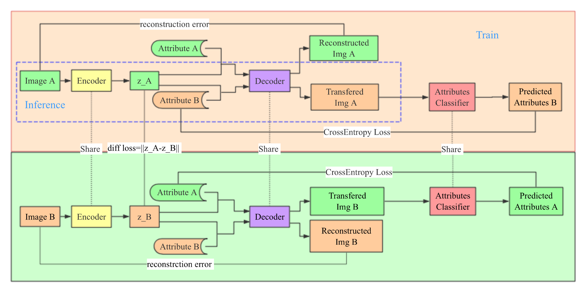

# Dual Training for Face Attribute Transfer

Change photograph of a person with attributes like wearing glasses or not

## Project Overview

Facial attribute transfer is an interesting task that you can get faces of a person with attributes you want. 
Since the aim of this task is to generate  an image, researchers always use generative adversarial net (GAN) and variational autoencoder (VAE). 
In this work, we also apply an encoder-decoder architecture to transfer facial attribute. 
Instead of using GAN, we present a dual architecture as shown in figure below to keep more pure information about the person in latent representation. 


The whole architecture consists of three components, which are encoder, decoder and classifier respectively.  
We try to encode attribute independent information into latent representation with our encoder and generate new image of given attributes with decoder. 
The classifier aims to classify attributes in generated images. 

In our model, we introduce dual training for better results. 
Note that image 1 and image 2 are from the same person. Thus they should be capable to transfer to each other. 
We design the dual architecture for training. 
Our loss includes two reconstruction errors, two classified errors and a latent differential error, which restricts the latent representations from two images of the same person to be similar.  

We permute pairs of different images of one person to get the training data.  
To make training efficient, we down sample the dataset to keep the target attributes of two images in a pair different.

## Code Statement

All the files of filtered data from CeleA dataset are in [***data***](./data) directory.

***preprocess.py***
 
Pre-process data to generate desired annotations.

***opts.py***

Experiment configuration information.

***model.py*** 

The training model we build.

***celebA.py*** 

Generate the dataset ```celebA``` .

***Train_Classfier.py*** 

Training code for the classfie.

***main.py***

Training code for whole network.
